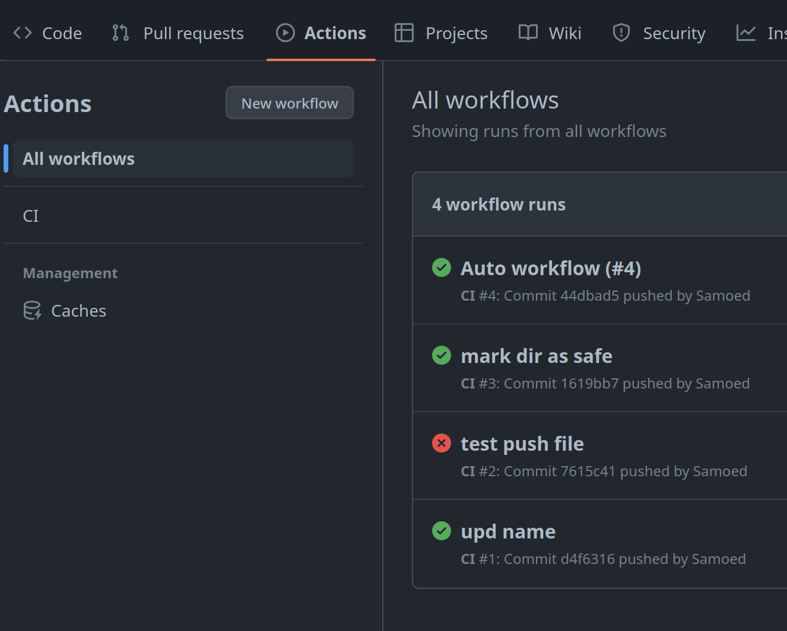
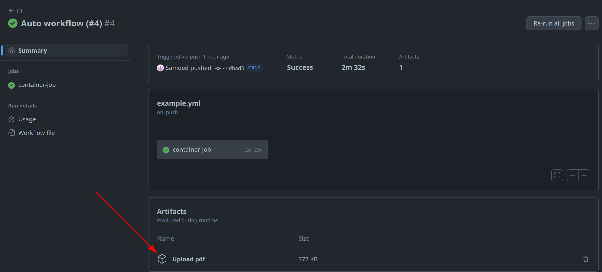

[](https://github.com/Samoed/NRU-HSE-Perm-LatexTemplate/actions/workflows/example.yml)
# NRU-HSE-Perm-LatexTemplate
Данный репозиторий содерижит шаблон LaTeX для написания курсовых и выпускных квалификационных работ, выполняющизся в Научно-исследовательском университете <<Высшая школа экономики>> (Пермь).

Первая версия шаблона создавалась в соответствии с [оффициальными требованиями](https://perm.hse.ru/ba/se/internships) бакалаврской программы <<Программная инженерия>> (2022/2023 учебный год).

Пример оформления работы в [diss-short.pdf](https://github.com/Samoed/NRU-HSE-Perm-LatexTemplate/blob/master/diss-short.pdf).
## Описание файлов
1. [requirements.tex](requirements.tex) - файл с оформлением требований в tex. Стиль берется из [HSEUniversity.cls](./HSEUniversity.cls).
2. [main.tex](main.tex) - пример для ВКР/КР. Стиль берется из [HSEUniversity.cls](./HSEUniversity.cls). Принимает параметры:
  1. Типы работы:
    - `KR` - курсовая работа
    - `VKR` - ВКР
    - `Study` - учебная практика
    - `Prod` - производственная практика
    - `Pregrad` - преддипломная практика
  2. Образовательные программы:
    - `PI` - программная инженерия
    - `BI` - бизнес информатика
  Также для рецензента или руководителя компании надо воспользоваться `\reviewer` или `\company` соответственно.
3. [TZ.tex](TZ.tex) - файл с оформлением технического задания. Есть пример добавления в [main.tex](main.tex#L205)
4. [lab_template](lab_template) - папка с шаблоном для оформления лабораторной работы.
5. [project_proposal](project_proposal) - папка с шаблоном для оформления Project Proposal на 4 курсе.
## Компиляция
### Overleaf
Скопировать шаблон и изменять его. При больших текстах Overleaf не будет успевать компилировать из-за ограничения времени.
### Локально
#### TexLive
Можно скачать TexLive, Emacs (или другие) и там работать с текстами. Для пользователей Linux надо установить:
- Ubuntu
  ```shell
  apt install texlive-full
  ```
- Arch (Manjaro)
  ```shell
  pacman -S texlive-full
  ```
#### Консоль
Для сборки pdf файла можно воспользоваться `latexmk`. Пример команды:

``` shell
latexmk -pdf -f -interaction=nonstopmode $FILENAME.tex
```

#### Докер
Данный способ работает, **_если нет обращения к родительской папке_**.

[Файл для сборки образа](./Dockerfile). Процесс сборки pdf с помощью Docker несколькими командами:
1. Сборка контейнера. 
   Здесь в качестве аргументов сборки передается название файла _FILENAME_ (**без расширения, например если файл main.tex, то передавать просто main**) и папка _DIR_, где файл находится. Если _tex_ файл находится в одной папке с _Dockerfile_. то `--build-arg="DIR=DIR"` можно не передавать. 
   ``` shell
   docker build . -t tag_name  --build-arg="DIR=DIR" --build-arg="FILENAME=FILENAME"
   ```
2. Запуск контейнера.
   Для получения файла надо запустить контейнер и скопировать оттуда файл. При запуске контейнера он будет работать 100 секунд. С параметром `--rm` после завершения работы контейнер удалится, чтобы не занимать память, `-d` работа контейнера не будет блокировать работу терминала, так как там просто выполнятся команда `sleep`, то ничего полезного в логах не будет. `--name` имя контейнера для дальнейшей работы с ним.
   ```shell
   docker run --rm -d --name run_name tag_name
   ```
 3. Копировать файл из контейнера
    `/doc/FILENAME.tex` путь готового pdf файла в контейнере, `DIR/FILENAME.pdf` путь к файлу на компьютере.
    ```shell
    docker cp run_name:/doc/FILENAME.tex DIR/FILENAME.pdf
    ```
Объединение всех команд в одну (**_не для Windows_**):
``` shell
DIR=DIR; FILENAME=FILENAME && \
runID=$(docker run --rm -d $(docker build . -q --build-arg="DIR=${DIR}" --build-arg="FILENAME=${FILENAME}")) && \
docker cp $runID:/doc/${FILENAME}.tex ${DIR}/${FILENAME}.pdf
```
Для работы этой команды поменять DIR и FILENAME на папку и название файла соответственно. 
### Github actions
Можно сделать, чтобы на каждое изменение файла он сохранялся, как артефакт workflow или сделать автоматическое добавление в репозиторий. [Пример файла со всеми способами.](./.github/workflows/example.yml "github workflow")
#### Action artifact
Для скачивания файла надо перейти в список запущенных actions

Перейти в последний, где была успешная сборка файла. И внизу будет готовый pdf.

#### Комит файла
Добавить в workflow [строчки](./.github/workflows/example.yml#L42-L53):

```yaml
- name: GIT commit and push pdf file
  env: 
    CI_COMMIT_MESSAGE: Continuous Integration Build Artifacts
    CI_COMMIT_AUTHOR: Continuous Integration
  if: github.event_name == 'push'
  run: |
    git config --global user.name "${{ env.CI_COMMIT_AUTHOR }}"
    git config --global user.email "username@users.noreply.github.com" # почта с которой будет автор комита
    git config --global --add safe.directory /__w/NRU-HSE-Perm-LatexTemplate/NRU-HSE-Perm-LatexTemplate # Поменять
    git add diss-short.pdf # готовый собранный файл
    git commit -m "${{ env.CI_COMMIT_MESSAGE }}"
    git push
```
## Советы
### Библиография
При указании источника в `*.bib` указывать `hyphenation={russian}` (или `language={russian}`) или `hyphenation={english}` в зависимости от языка работы.
#### Цитирования в стиле гост 2011
Для изменения стиля цитирования под 2008 гост убрать эти строки.
``` tex
  \ltx@iffilelater{biblatex-gost.def}{2017/05/03}%
  {\toggletrue{bbx:gostbibliography}%
  \renewcommand*{\revsdnamepunct}{\addcomma}}{}
```
#### Количество страниц и иллюстраций.
Для автоматического подсчета количества таблиц и иллюстраций указать:

``` tex
Количество страниц -- \pageref*{pg:end}, количество иллюстраций -- \TotalValue{totalfigures}, количетсво таблиц -- \TotalValue{totaltables}.
```

## Известные проблемы
### Длинный заголовок
Если будет длинный заголовок, как:


то можно делать `chapter*`:
``` tex
\chapter*{ПРИЛОЖЕНИЕ А Техническое задание на разрабатываемую систему}
\stepcounter{chapter} % чтобы увеличить значение счетчика
```
Это происходит из-за того, что $\LaTeX{}$ центрирует текст заголовка отдельно от счетчика, я не нашел другой фикс, чтобы было адекватно. Пытался \centering делать в prefix заголовка, но тогда при переносе слов они будут сразу под началом заголовка, отключение переноса делает также.
### Ссылки на longtblr
Пакет `xassoccnt` конфликтует с `calc`, из-за этого ссылки на `longtblr` могут сломаться, если делать `\begin{longtblr}[caption={name},label={tbl:qwer}]`. Лучше делать `\begin{longtblr}[caption={name\label{tbl:test}}]`.
